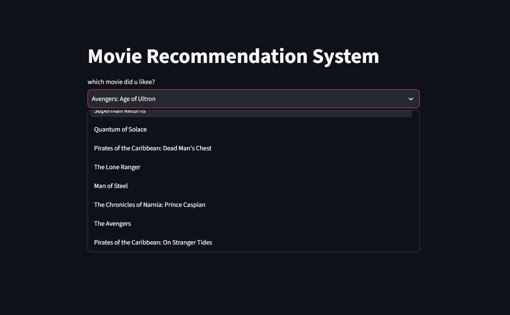
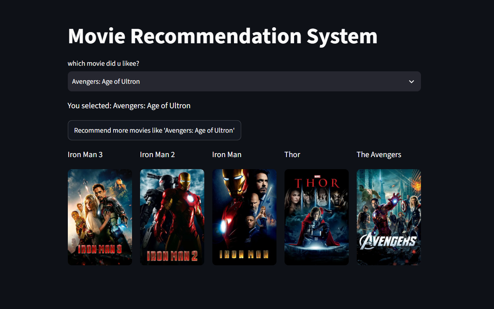

# 🎬 Movie Recommendation System

A Machine Learning-based **content-based movie recommendation system** that suggests similar movies based on user-selected movies.

The application uses **Natural Language Processing (NLP)** techniques to analyze movie metadata and recommends movies using similarity-based search. The project is deployed as an interactive **Streamlit web application**.

## 🚀 Live Demo

🔗 **Streamlit App:**  
https://movie-recommendation-system-5cgb.onrender.com

---

## 📌 Project Overview

This project implements a **Content-Based Filtering Recommendation System**.

The system analyzes movie information such as:
- Movie title
- Genres
- Cast
- Crew
- Keywords
- Overview

The text data is transformed into numerical vectors using **CountVectorizer**, and similar movies are identified using the **Nearest Neighbors algorithm**.

Users can select a movie from the application, and the system returns the top 5 recommended movies along with their posters.

---

## ✨ Features

- 🎥 Search and select movies from a large movie database
- 🤖 Machine Learning-based recommendations
- 🔍 Content-based filtering approach
- 🧠 NLP feature extraction using CountVectorizer
- 🎯 Finds similar movies using Nearest Neighbors
- 🖼️ Displays movie posters using TMDB API
- 🌐 Interactive Streamlit web interface
- 🚀 Deployed using Render

---

## 🛠️ Technologies Used

### Programming Language
- Python

### Libraries & Frameworks
- Pandas
- NumPy
- Scikit-learn
- Streamlit
- Requests

### APIs
- TMDB API (Movie posters)

### Deployment
- GitHub
- Render

---

## 🧠 Machine Learning Approach

### 1. Data Preprocessing

Movie metadata is combined into a single text feature containing:

```
Genres + Cast + Crew + Keywords + Overview
```

This creates a meaningful representation of each movie.

---

### 2. Feature Extraction

The text data is converted into numerical vectors using:

```
CountVectorizer
```

This allows the machine learning model to understand similarities between movies.

---

### 3. Recommendation Algorithm

The recommendation engine uses:

```
Nearest Neighbors Algorithm
```

The model identifies movies with the closest vector distance and returns the most similar movies.

---

## 📂 Project Structure

```
Movie-Recommandation-System/
│
├── app.py                    # Streamlit application
├── main.py                   # Model creation notebook/script
│
├── movies_list_dict.pkl      # Movie dataset
├── vectors.pkl               # Movie feature vectors
├── model.pkl                 # Trained recommendation model
│
├── requirements.txt          # Python dependencies
├── Procfile                  # Deployment configuration
├── README.md                 # Project documentation
│
└── screenshots/
    ├── home.png
    └── recommendation.png
```

---

## 📸 Application Screenshots

### 🏠 Home Page




### 🎯 Movie Recommendations



---

## ⚙️ Installation & Setup

### Clone the repository

```bash
git clone https://github.com/suryaktechz-lgtm/Movie-Recommandation-System.git
```

### Navigate to project directory

```bash
cd Movie-Recommandation-System
```

### Create virtual environment

```bash
python -m venv .venv
```

### Activate environment

Windows:

```bash
.venv\Scripts\activate
```

### Install dependencies

```bash
pip install -r requirements.txt
```

### Run Streamlit application

```bash
streamlit run app.py
```

The application will open at:

```
http://localhost:8501
```

---

## 📦 Deployment

The application is deployed using **Render**.

Deployment configuration:

### Build Command

```bash
pip install -r requirements.txt
```

### Start Command

```bash
streamlit run app.py --server.port $PORT --server.address 0.0.0.0
```

---


## 🔮 Future Improvements

- Add user-based collaborative filtering
- Improve recommendations using advanced embeddings
- Add movie ratings and reviews
- Add user login and personalized recommendations
- Deploy using Docker
- Use deep learning-based recommendation models

---

## 👨‍💻 Author

**Surya K**

AIML Student | Machine Learning Enthusiast

GitHub:
https://github.com/suryaktechz-lgtm

